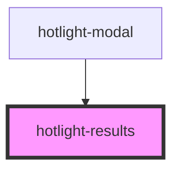

# my-component

<!-- Auto Generated Below -->

## Properties

| Property  | Attribute | Description | Type                                                                                                                                         | Default |
| --------- | --------- | ----------- | -------------------------------------------------------------------------------------------------------------------------------------------- | ------- |
| `actions` | --        |             | `HotlightAction[]`                                                                                                                           | `[]`    |
| `config`  | --        |             | `{ opened?: boolean; stayOpened?: boolean; query?: string; maxHits?: number; placeholder?: string; sources?: { [name: string]: Source; }; }` | `{}`    |

## Events

| Event              | Description | Type                                                                                    |
| ------------------ | ----------- | --------------------------------------------------------------------------------------- |
| `commandk:clear`   |             | `CustomEvent<{ level: number; parents: HotlightAction[]; actions: HotlightAction[]; }>` |
| `commandk:trigger` |             | `CustomEvent<{}>`                                                                       |

## Dependencies

### Used by

 - [hotlight-modal](../hotlight-modal)

### Graph

----------------------------------------------

*Built with [StencilJS](https://stenciljs.com/)*
