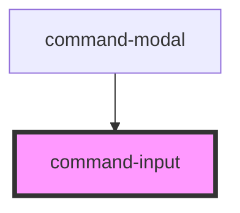

# my-component

<!-- Auto Generated Below -->

## Events

| Event            | Description | Type                  |
| ---------------- | ----------- | --------------------- |
| `commandk:close` |             | `CustomEvent<any>`    |
| `commandk:query` |             | `CustomEvent<string>` |

## Dependencies

### Used by

 - [command-modal](../command-modal)

### Graph

----------------------------------------------

*Built with [StencilJS](https://stenciljs.com/)*
