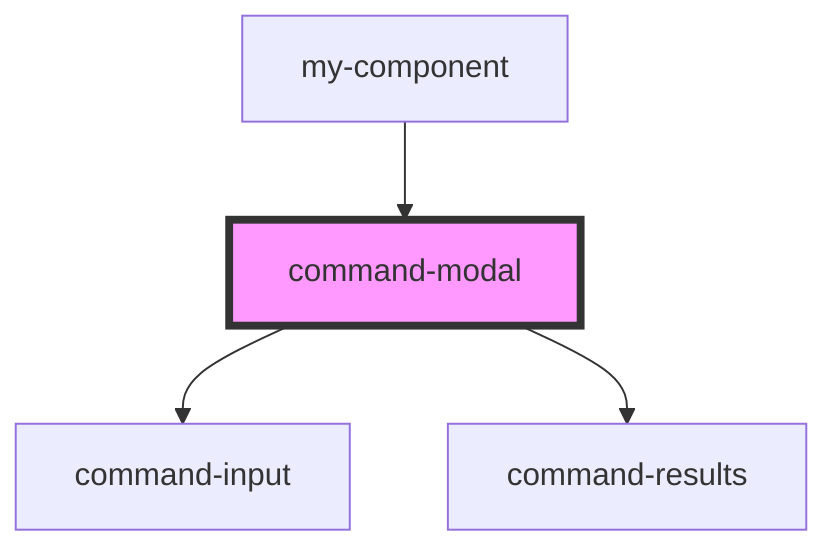

# my-component

<!-- Auto Generated Below -->

## Dependencies

### Used by

 - [my-component](../my-component)

### Depends on

- [command-input](../command-input)
- [command-results](../command-results)

### Graph

----------------------------------------------

*Built with [StencilJS](https://stenciljs.com/)*
