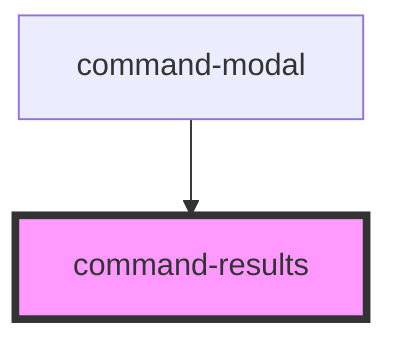

# my-component

<!-- Auto Generated Below -->

## Events

| Event              | Description | Type              |
| ------------------ | ----------- | ----------------- |
| `commandk:trigger` |             | `CustomEvent<{}>` |

## Dependencies

### Used by

 - [command-modal](../command-modal)

### Graph

----------------------------------------------

*Built with [StencilJS](https://stenciljs.com/)*
