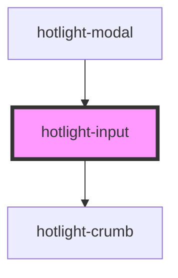

# my-component

<!-- Auto Generated Below -->

## Properties

| Property | Attribute | Description | Type                                                                                                                                         | Default |
| -------- | --------- | ----------- | -------------------------------------------------------------------------------------------------------------------------------------------- | ------- |
| `config` | --        |             | `{ opened?: boolean; stayOpened?: boolean; query?: string; maxHits?: number; placeholder?: string; sources?: { [name: string]: Source; }; }` | `{}`    |

## Events

| Event            | Description | Type                  |
| ---------------- | ----------- | --------------------- |
| `commandk:close` |             | `CustomEvent<any>`    |
| `commandk:query` |             | `CustomEvent<string>` |
| `goUp`           |             | `CustomEvent<any>`    |

## Dependencies

### Used by

 - [hotlight-modal](../hotlight-modal)

### Depends on

- [hotlight-crumb](../hotlight-crumb)

### Graph

----------------------------------------------

*Built with [StencilJS](https://stenciljs.com/)*
