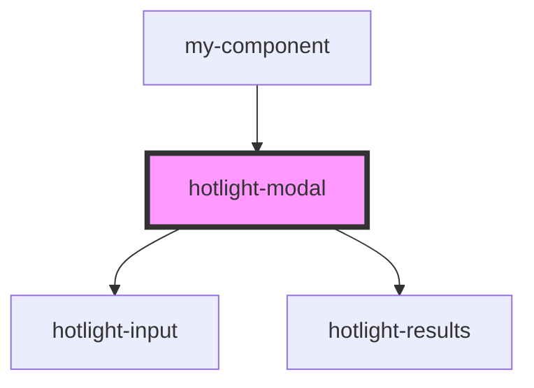

# my-component

<!-- Auto Generated Below -->

## Properties

| Property | Attribute | Description | Type                                                                                                                   | Default |
| -------- | --------- | ----------- | ---------------------------------------------------------------------------------------------------------------------- | ------- |
| `config` | --        |             | `{ opened?: boolean; stayOpened?: boolean; query?: string; maxHits?: number; sources?: { [name: string]: Source; }; }` | `{}`    |

## Dependencies

### Used by

 - [my-component](../my-component)

### Depends on

- [hotlight-input](../hotlight-input)
- [hotlight-results](../hotlight-results)

### Graph

----------------------------------------------

*Built with [StencilJS](https://stenciljs.com/)*
