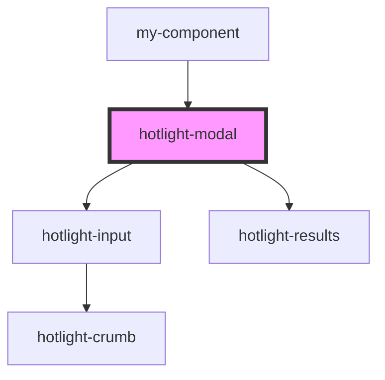

# my-component

<!-- Auto Generated Below -->

## Properties

| Property  | Attribute | Description | Type                                                                                                                                         | Default |
| --------- | --------- | ----------- | -------------------------------------------------------------------------------------------------------------------------------------------- | ------- |
| `actions` | --        |             | `HotlightAction[]`                                                                                                                           | `[]`    |
| `config`  | --        |             | `{ opened?: boolean; stayOpened?: boolean; query?: string; maxHits?: number; placeholder?: string; sources?: { [name: string]: Source; }; }` | `{}`    |

## Dependencies

### Used by

 - [my-component](../my-component)

### Depends on

- [hotlight-input](../hotlight-input)
- [hotlight-results](../hotlight-results)

### Graph

----------------------------------------------

*Built with [StencilJS](https://stenciljs.com/)*
