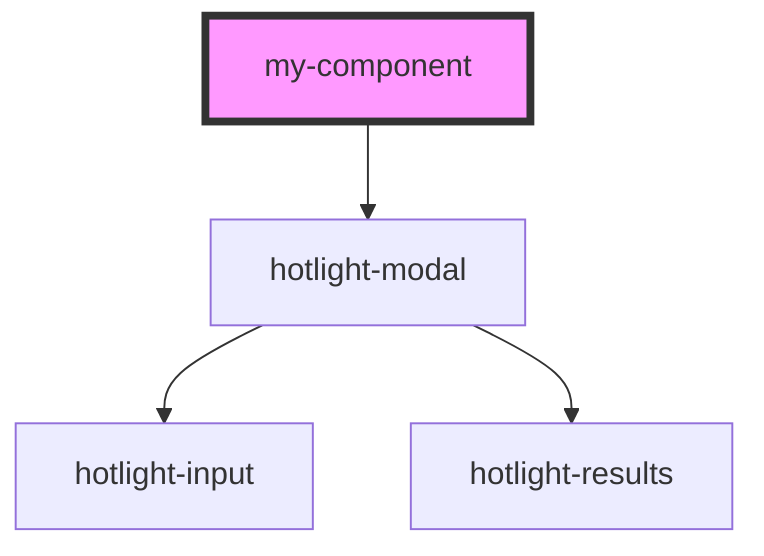

# my-component

<!-- Auto Generated Below -->

## Properties

| Property | Attribute | Description | Type                                                                        | Default     |
| -------- | --------- | ----------- | --------------------------------------------------------------------------- | ----------- |
| `config` | --        |             | `{ launch: string; token?: string; sources: { [name: string]: Source; }; }` | `undefined` |

## Events

| Event           | Description | Type              |
| --------------- | ----------- | ----------------- |
| `commandk:open` |             | `CustomEvent<{}>` |

## Dependencies

### Depends on

- [hotlight-modal](../hotlight-modal)

### Graph

----------------------------------------------

*Built with [StencilJS](https://stenciljs.com/)*
